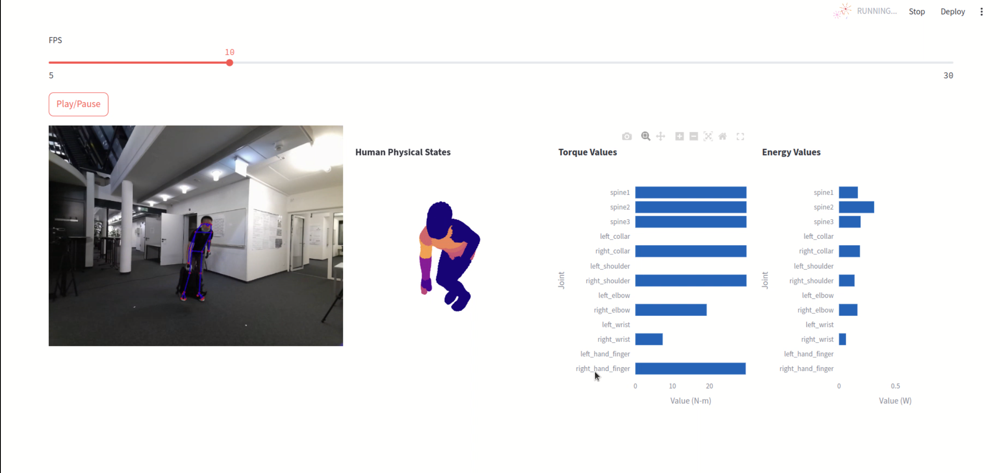

# sbs_hoi_demo


## Setup
### 4D-Humans

Navigate to https://github.com/shubham-goel/4D-Humans. Follow their instructions to install the environment.
This should create a conda environment named 
`
4D-humans
`
.
In addition, to use fastSAM, run
`
pip install ultralytics
`

### mmpose

Navigate to https://github.com/open-mmlab/mmpose. Follow their instructions to install the environment.
This should create a conda environment named
`
openmmlab
`
.

Download the checkpoint for rtmpose3d: https://download.openmmlab.com/mmpose/v1/wholebody_3d_keypoint/rtmw3d/rtmw3d-l_8xb64_cocktail14-384x288-794dbc78_20240626.pth, and place it in the 
`
checkpoints/
`
folder.

### Create your own environment

```
conda create -n sbs_hoi_demo python=3.10
conda activate sbs_hoi_demo
```

Install pytorch:
```
conda install pytorch torchvision torchaudio pytorch-cuda=12.1 -c pytorch -c nvidia
```

Install other required package via pip:
``` 
streamlit
opencv-python
scikit-learn
open3d
videoio
zmq
numpy==1.26.4
```

Last, put torque file in 
`
data/
`

## Start Demo
```
streamlit run --server.maxUploadSize 1000 demo.py -- --bar --torque_file PATH_TO_TORQUE_FILE

```

